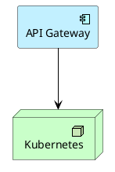
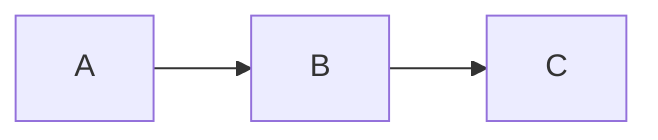

# TOGAF Financial Enterprise Architecture Blueprint

Repositorio base para implementar una práctica de Arquitectura Empresarial en una organización financiera de tarjetas, pagos, crédito, comercios afiliados y canales digitales.

Este repo adapta el ADM de TOGAF a un contexto financiero regulado. No contiene todos los entregables disponibles de TOGAF, prioriza los documentos que una empresa podria necesitar para gobernar.

## Objetivos

- Crear una base reutilizable para futuras iniciativas de arquitectura empresarial.
- Alinear negocio, datos, aplicaciones, tecnología y seguridad.
- Formalizar decisiones mediante ADRs.
- Definir estándares reutilizables para APIs, eventos, integración, datos, observabilidad y seguridad.
- Facilitar gobierno arquitectónico sin convertirlo en burocracia.
- Publicar documentación con GitHub Pages.

## Contexto empresarial de referencia

Organización financiera con:

- emisión de tarjetas;
- adquirencia y comercios afiliados;
- pagos digitales;
- canales web y mobile;
- originación de crédito;
- motor de riesgo;
- antifraude;
- conciliación y liquidación;
- programas de fidelización;
- atención al cliente;
- integración con procesadores, marcas de tarjeta, bureaus, bancos, fintechs y reguladores.

## Estructura ADM


| Fase                | Propósito                          | Carpeta                                          |
| ------------------- | ----------------------------------- | ------------------------------------------------ |
| Preliminary         | Preparar capacidad de arquitectura  | `docs/01-preliminary`                            |
| Phase A             | Definir visión y alcance           | `docs/02-phase-a-architecture-vision`            |
| Phase B             | Arquitectura de negocio             | `docs/03-phase-b-business-architecture`          |
| Phase C Data        | Arquitectura de datos               | `docs/04-phase-c-data-architecture`              |
| Phase C Application | Arquitectura de aplicaciones        | `docs/05-phase-c-application-architecture`       |
| Phase D             | Arquitectura tecnológica           | `docs/06-phase-d-technology-architecture`        |
| Phase E             | Oportunidades y soluciones          | `docs/07-phase-e-opportunities-solutions`        |
| Phase F             | Plan de migración                  | `docs/08-phase-f-migration-planning`             |
| Phase G             | Gobierno de implementación         | `docs/09-phase-g-implementation-governance`      |
| Phase H             | Gestión del cambio arquitectónico | `docs/10-phase-h-architecture-change-management` |
| Requirements        | Gestión continua de requerimientos | `docs/11-requirements-management`                |

# Principios de diseño

- Cloud-native cuando aporte velocidad, resiliencia y eficiencia.
- Seguridad por diseño.
- APIs y eventos como contratos empresariales.
- Datos gobernados como activo corporativo.
- Plataforma como producto interno.
- Automatización sobre procesos manuales.
- Observabilidad obligatoria para servicios críticos.
- Desacoplamiento progresivo del core legado.

# Generación de diagramas

Este repositorio utiliza múltiples notaciones de diagramas según el tipo de arquitectura o artefacto documentado.

## Tecnologías utilizadas

| Tipo de diagrama | Herramienta | Formato fuente | Output |
|---|---|---|---|
| Enterprise Architecture (TOGAF) | ArchiMate + PlantUML | `.puml` | `.svg` |
| Diagramas UML | PlantUML | `.puml` | `.svg` |
| Diagramas C4 | (Opcional) Structurizr / PlantUML | DSL / `.puml` | `.svg` |
| Flujos simples / Roadmaps | Mermaid | Markdown | Render en navegador |
| Secuencias rápidas | Mermaid / PlantUML | Markdown / `.puml` | Browser / `.svg` |


## 1. ArchiMate

Los diagramas de arquitectura empresarial (TOGAF) se modelan usando ArchiMate sobre PlantUML.

Ubicación de archivos fuente:

```text
docs/15-diagrams/archimate/
```

Ejemplo:



Estos archivos NO son imágenes; son código declarativo.

## 2. PlantUML

PlantUML convierte archivos `.puml` a imágenes.

Flujo:

```text
.puml → PlantUML parser → SVG / PNG
```

Ejemplo de render manual:

```bash
java -jar plantuml.jar -tsvg diagram.puml
```

En CI/CD se usa Docker:

```bash
docker run --rm \
  -v "$PWD:/workspace" \
  -w /workspace \
  plantuml/plantuml \
  -tsvg \
  docs/15-diagrams/archimate/*.puml
```

Esto genera archivos SVG en:

```text
docs/assets/diagrams/archimate/
```

Ejemplo de output:

```text
05-technology-platform-view.svg
```

## 3. Mermaid

Mermaid se usa para diagramas simples embebidos en Markdown:

- flowcharts
- sequence diagrams
- timelines
- roadmaps
- governance workflows

Ejemplo:



Mermaid NO genera archivos SVG durante el build.

El render ocurre directamente en el navegador mediante JavaScript durante la carga de GitHub Pages.

# Quick start

```bash
pip install mkdocs-material
mkdocs serve
```

# Publicacion 

El workflow de GitHub Actions renderiza a SVG y publica todo el contenido del repo en GitHub Pages.

## mkdocs.yml

El archivo `mkdocs.yml` configura la documentación publicada en GitHub Pages:

- estructura de navegación
- tema visual
- plugins/extensiones
- configuración de Mermaid
- validación de links e imágenes

## Archivos `.puml`

Los archivos `.puml` son diagramas escritos como código (Diagram as Code).  
Durante el pipeline de GitHub Actions, PlantUML los convierte a imágenes SVG.

Flujo:

```text
.puml → PlantUML → .svg → MkDocs → GitHub Pages
```
