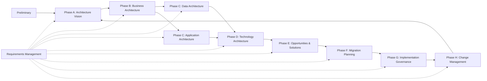

# Mapa ADM adaptado

# Adaptación usada

TOGAF ADM es iterativo. Para una empresa financiera, la implementación práctica debe evitar una ejecución waterfall pesada. Las fases se usan como marco de pensamiento y como checklist de entregables.

# Entregables mínimos por ciclo

| Fase | Entregable mínimo |
|---|---|
| Preliminary | Principios, modelo de gobierno, metamodelo mínimo |
| A | Architecture Vision, stakeholders, business case |
| B | Capability map, value streams, gaps |
| C Data | Data domains, ownership, governance |
| C App | Application landscape, integration map, APIs |
| D | Technology standards, platform blueprint |
| E | Solution building blocks, transition architectures |
| F | Roadmap, dependency map |
| G | Architecture contract, compliance checklist |
| H | Change control, exceptions, backlog arquitectónico |
