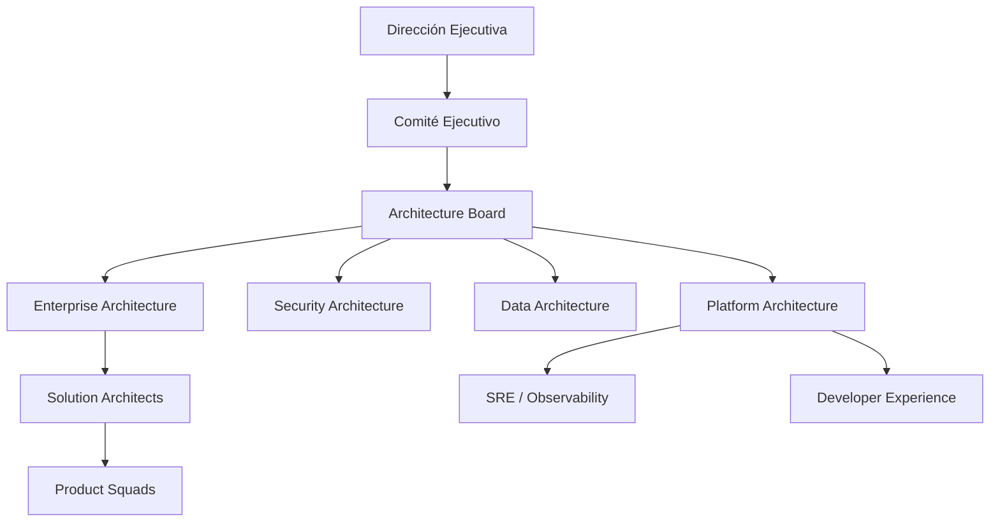

# Capability de arquitectura

# Misión

Establecer una función de arquitectura empresarial que conecte estrategia, 
ejecución y gobierno tecnológico para la organizacion

# Alcance

Incluye:
- arquitectura empresarial;
- arquitectura de soluciones;
- arquitectura de datos;
- arquitectura de seguridad;
- arquitectura de plataforma;
- estándares tecnológicos;
- gobierno de APIs, eventos y datos;
- evaluación de iniciativas estratégicas.

No incluye:
- operación diaria de infraestructura;
- administración directa de proyectos;
- desarrollo de software de squads;
- soporte de producción de primer nivel.

# Modelo operativo

# Responsabilidades

| Rol | Responsabilidades |
|---|---|
| Architecture Board | Aprobar principios, excepciones, estándares y decisiones de alto impacto |
| Enterprise Architect | Mantener mapa de capacidades, dominios y roadmap |
| Solution Architect | Diseñar soluciones alineadas a estándares |
| Security Architect | Definir controles de identidad, cifrado, red y cumplimiento |
| Data Architect | Definir dominios, linaje, calidad y gobierno |
| Platform Architect | Definir golden paths, Kubernetes, CI/CD, observabilidad y runtime |

# Métricas

- Porcentaje de iniciativas con revisión arquitectónica.
- Porcentaje de APIs registradas en catálogo.
- Porcentaje de eventos con contrato versionado.
- Reducción de aplicaciones redundantes.
- Reducción de incidentes por falta de observabilidad.
- Tiempo promedio de onboarding de un nuevo microservicio.

#pendiente: agregar foluma de metricas