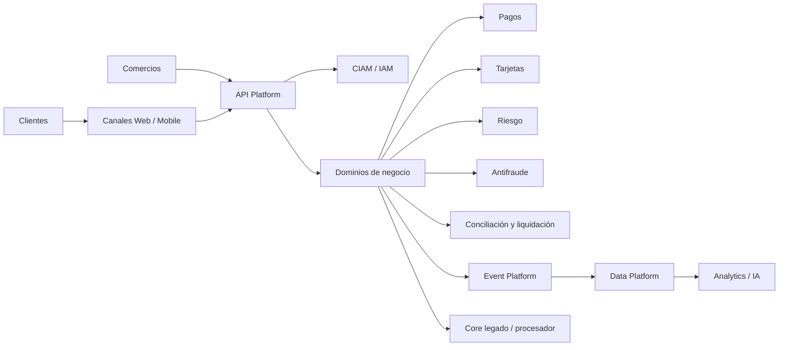

# Architecture Vision

# Problema

La organización opera con sistemas core, canales digitales, 
integraciones con terceros, procesos batch y plataformas de datos que han 
crecido de manera heterogénea. Esto genera:

- time-to-market lento;
- duplicidad de capacidades;
- integraciones punto a punto;
- dependencia de procesos manuales;
- baja trazabilidad de datos;
- costos crecientes de operación;
- dificultad para cumplir controles de seguridad y auditoría de forma automatizada.

# Visión objetivo

Construir una arquitectura empresarial modular, segura, observable y orientada 
a capacidades, que permita acelerar productos financieros digitales, 
mejorar resiliencia operativa y reducir riesgo tecnológico.

# Drivers de negocio

| Driver | Descripción | Impacto arquitectónico |
|---|---|---|
| Crecimiento digital | Más adquisición y autoservicio por canales digitales | APIs, CIAM, experiencia omnicanal |
| Eficiencia operativa | Reducir procesos manuales y reprocesos | Automatización, BPM, eventos |
| Control de riesgo | Mejor prevención de fraude y riesgo crediticio | Datos confiables, decisión en tiempo real |
| Cumplimiento | Evidencias auditables y trazabilidad | Seguridad, logging, data governance |
| Ecosistema | Integración con comercios, bancos, fintechs y procesadores | API management, event streaming |
| Modernización | Reducir dependencia de legado | Strangler pattern, dominios, transición |

# Alcance inicial

Incluye:
- canales digitales;
- onboarding y originación;
- autorización y autenticación;
- tarjetas y cuentas;
- pagos;
- comercios afiliados;
- riesgos y fraude;
- conciliación y liquidación;
- datos analíticos y operativos;
- plataforma cloud-native.

# Fuera de alcance inicial

- reemplazo completo del core financiero;
- rediseño de todos los procesos contables;
- selección final de todos los vendors;
- implementación detallada por squad.

# Arquitectura conceptual

# Criterios de éxito

- 80% de nuevas integraciones expuestas por APIs gobernadas.
- 100% de servicios críticos con observabilidad mínima.
- Reducción progresiva de integraciones batch críticas.
- Capacidad de auditar decisiones de riesgo, seguridad y datos.
- Reducción de duplicidad funcional entre aplicaciones.
- Roadmap de transición aprobado por negocio y tecnología.
