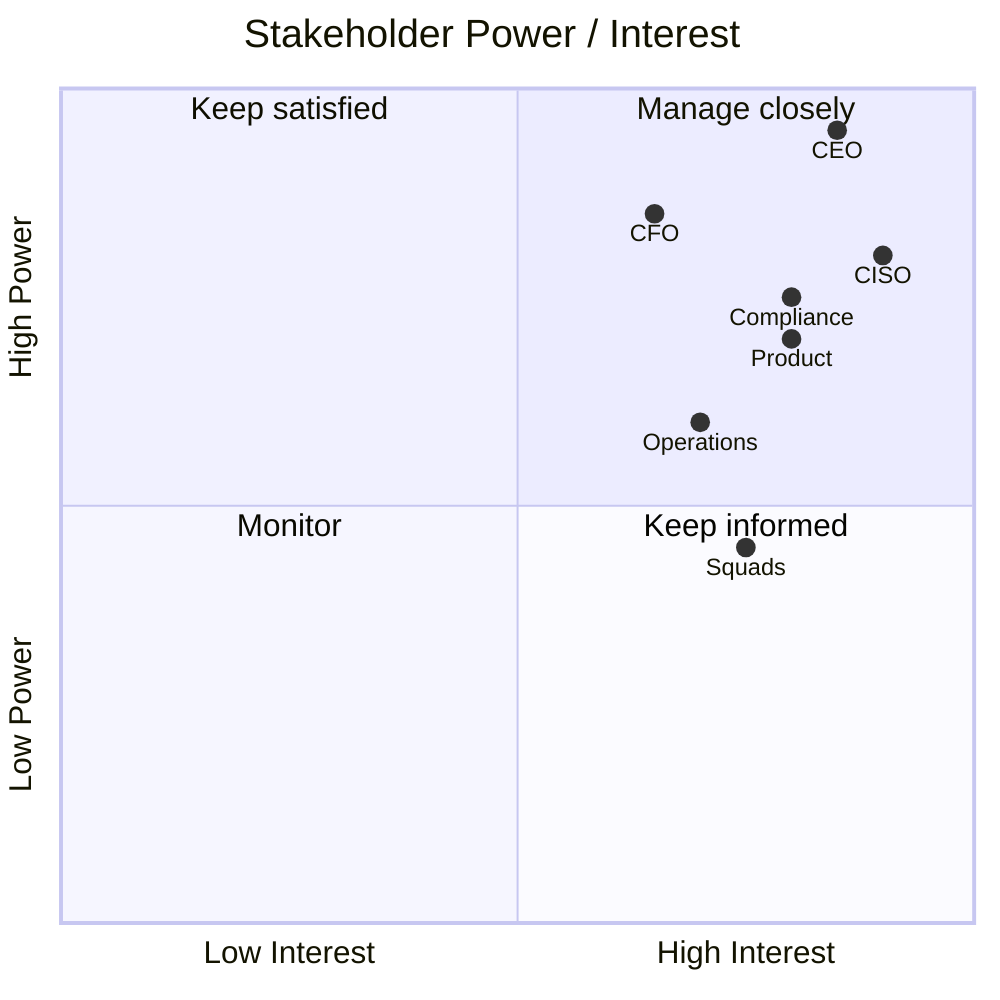

# Stakeholder Map

# Stakeholders clave

| Stakeholder | Interés | Preocupación | Entregable relevante |
|---|---|---|---|
| CEO / Gerencia General | Crecimiento, eficiencia, riesgo | Velocidad sin comprometer control | Architecture Vision, Roadmap |
| CFO | Costos, rentabilidad, CAPEX/OPEX | Retorno de inversión | Business Case, Roadmap |
| COO | Operación estable | Impacto en procesos críticos | Migration Plan, Implementation Governance |
| CISO | Seguridad, cumplimiento | Riesgos de identidad, datos y terceros | Security Architecture |
| CTO / CIO | Plataforma tecnológica | Complejidad, deuda técnica, escalabilidad | Technology Architecture |
| Head de Producto | Time-to-market | Dependencias y cuellos de botella | Capability Map, API Catalog |
| Riesgos | Score, originación, fraude | Trazabilidad y explicabilidad | Data Architecture, Decision Logs |
| Legal / Compliance | Regulación y auditoría | Evidencias y privacidad | Governance Model |
| Squads | Delivery | Estándares demasiado pesados | Golden Paths, Templates |
| Operaciones TI | Estabilidad | Observabilidad y soporte | Runbooks, SLOs |

# Matriz poder/interés

