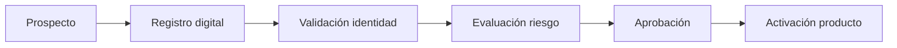
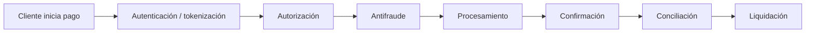
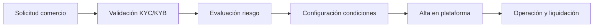

# Business Architecture

# Value streams principales

## 1. Adquirir cliente

## 2. Procesar pago

## 3. Afiliar comercio

# Modelo operativo objetivo

| Dominio | Owner de negocio | Owner tecnológico | KPIs |
|---|---|---|---|
| Cliente | Producto digital | Squad identidad/canales | Conversión, NPS, éxito login |
| Pagos | Operaciones pagos | Squad pagos | Autorizaciones exitosas, latencia |
| Comercio | Negocio comercios | Squad merchant platform | Alta comercio, volumen procesado |
| Riesgo | Riesgos | Squad risk platform | Precisión score, fraude evitado |
| Datos | Data Office | Data Platform | Calidad, linaje, disponibilidad |
| Plataforma | Tecnología | Platform Engineering | Lead time, disponibilidad, adopción |

# Reglas de negocio transversales

- Toda decisión de originación debe ser trazable.
- Toda transacción financiera debe ser idempotente.
- Todo evento de negocio relevante debe tener identificador único y timestamp.
- Toda operación sensible debe tener auditoría.
- Todo cambio contractual de API debe ser versionado.
