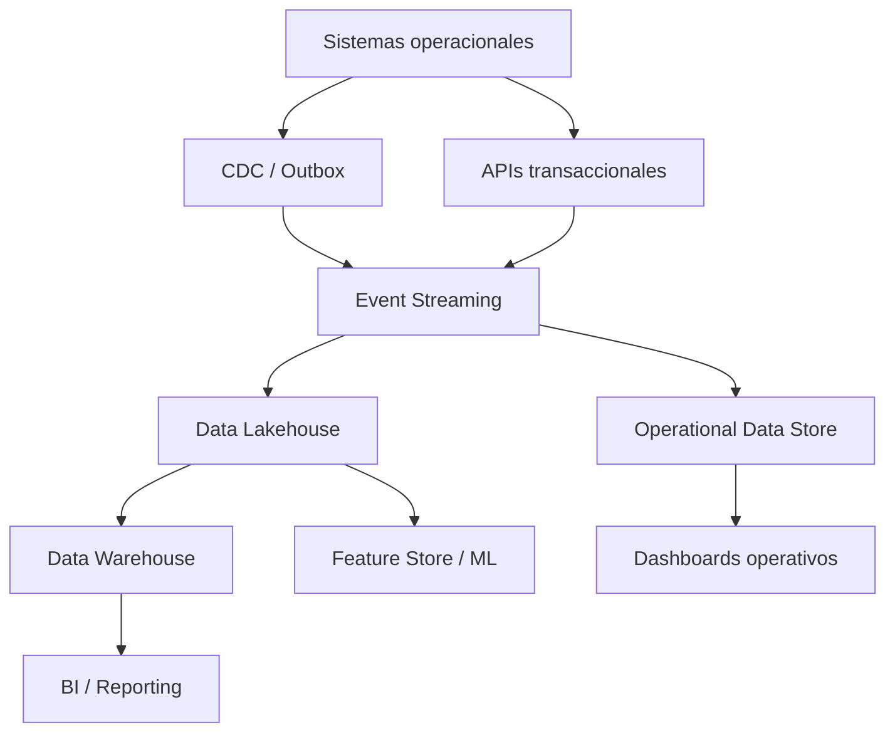

# Data Architecture

# Principios de datos

- Los datos se organizan por dominios de negocio.
- Cada dominio tiene data owner y data steward.
- Los datos sensibles se clasifican y protegen por defecto.
- El linaje debe cubrir sistemas fuente, transformaciones y consumo.
- Los modelos analíticos no deben depender de extracciones manuales.
- La calidad de datos debe medirse con reglas automatizadas.

# Dominios de datos

| Dominio | Entidades principales | Owner | Sensibilidad |
|---|---|---|---|
| Cliente | Cliente, identidad, contacto, consentimiento | Negocio cliente | Alta |
| Producto | Tarjeta, cuenta, crédito, beneficios | Producto | Alta |
| Transacción | Pago, autorización, reversa, disputa | Pagos | Alta |
| Comercio | Comercio, terminal, condiciones, liquidación | Comercios | Media/Alta |
| Riesgo | Score, regla, decisión, alerta | Riesgos | Alta |
| Fraude | Señal, caso, investigación, bloqueo | Fraude | Alta |
| Operaciones | Reclamo, conciliación, asiento, lote | Operaciones | Media |
| Auditoría | Evento, actor, evidencia, control | Compliance | Alta |

# Arquitectura lógica

# Reglas críticas

- Datos PCI no deben propagarse fuera de zonas controladas.
- PAN debe tokenizarse o enmascararse según caso de uso.
- PII debe cifrarse en tránsito y reposo.
- Accesos a datos sensibles deben quedar auditados.
- Modelos de riesgo deben guardar versión de variables, score y decisión.
