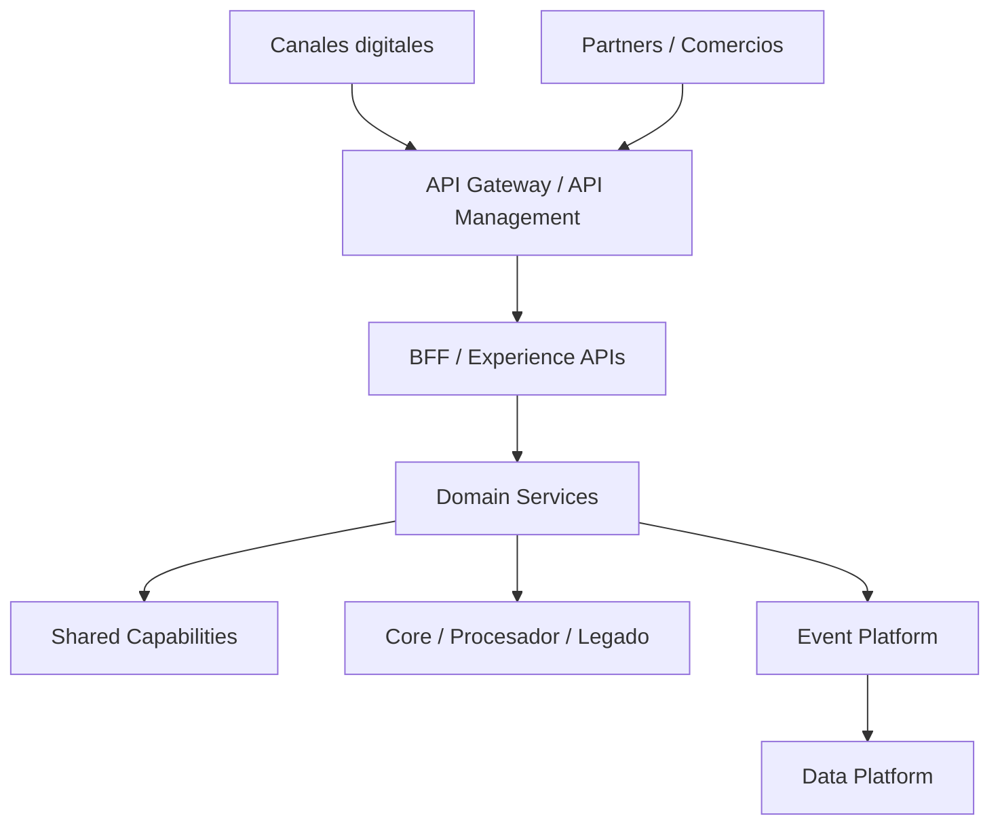

# Application Architecture

# Capas objetivo

# Dominios de aplicación

| Dominio | Servicios objetivo |
|---|---|
| Identidad | CIAM, MFA, consentimiento, perfil digital |
| Cliente | Customer profile, preferences, contactability |
| Tarjetas | Card lifecycle, activation, limits, block/unblock |
| Pagos | Payment authorization, payment status, reversals |
| Comercios | Merchant onboarding, settlement, merchant portal |
| Riesgo | Credit decisioning, risk rules, score orchestration |
| Fraude | Transaction monitoring, case management, alerts |
| Operaciones | Disputes, claims, reconciliation, backoffice |
| Plataforma | API catalog, developer portal, observability, secrets |

# Criterios de racionalización

Una aplicación debe evaluarse por:

- criticidad de negocio;
- costo de mantenimiento;
- duplicidad funcional;
- obsolescencia tecnológica;
- nivel de acoplamiento;
- exposición a riesgo operativo;
- cumplimiento de seguridad;
- capacidad de integración.

# Patrones recomendados

| Necesidad | Patrón |
|---|---|
| Modernizar core sin big bang | Strangler Fig |
| Integración asíncrona confiable | Transactional Outbox |
| Lecturas de alto volumen | CQRS |
| Evitar doble procesamiento | Idempotency Key |
| Orquestar flujos largos | Saga |
| Proteger servicios críticos | Circuit Breaker |
| Exponer servicios externos | API Gateway + OAuth2/OIDC |
