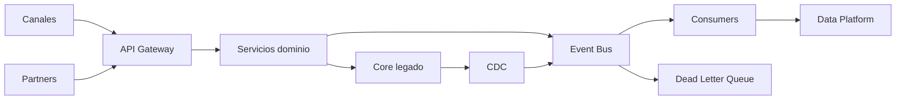

# Integration Architecture

# Estilos de integración

| Estilo | Uso recomendado | Evitar cuando |
|---|---|---|
| REST API | Consulta/comando sincrónico, experiencia digital | Procesos de larga duración |
| Eventos | Notificación de hechos de negocio | Se requiere respuesta inmediata |
| Batch | Conciliaciones masivas no urgentes | Flujos near real-time |
| CDC | Sincronización desde sistemas legados | No hay control sobre cambios semánticos |
| Files managed | Integración regulada con terceros legacy | Se necesita trazabilidad transaccional inmediata |

# Arquitectura objetivo

# Reglas

- No se permiten integraciones punto a punto nuevas sin excepción aprobada.
- Toda API externa debe pasar por API Management.
- Todo evento debe tener contrato, propietario, versión y política de retención.
- Todo consumidor debe ser idempotente.
- Todo error asíncrono debe ir a DLQ con trazabilidad.
- Las integraciones con terceros deben tener timeout, retry policy y circuito de protección.
