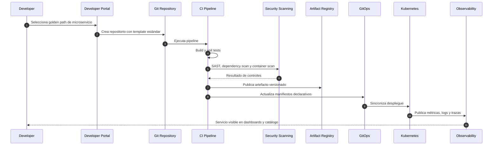

# Platform Architecture

# Plataforma como producto

La plataforma interna debe ofrecer capacidades reutilizables para que los squads entreguen software seguro, observable y gobernado sin reinventar infraestructura.

Esta sección separa dos tipos de diagramas:

| Tipo de vista | Notación recomendada | Motivo |
|---|---|---|
| Vista general de plataforma | ArchiMate | Representa capacidades, componentes de aplicación y servicios tecnológicos |
| Golden path de microservicio | Mermaid / UML Sequence | Representa una secuencia temporal de pasos del desarrollador y la plataforma |

# Capacidades de plataforma

| Capacidad | Descripción |
|---|---|
| Developer Portal | Catálogo de servicios, APIs, owners, documentación y scorecards |
| Golden Paths | Plantillas listas para microservicios, workers, APIs y jobs |
| CI/CD | Build, test, security scanning, artifact publishing |
| GitOps | Despliegue declarativo y auditable |
| Observability | Métricas, logs, trazas, alertas y SLOs |
| Secrets | Gestión centralizada de secretos y rotación |
| Policy as Code | Validación de estándares antes del despliegue |
| Runtime | Kubernetes, service mesh y autoscaling |
| FinOps | Visibilidad de costos, tagging y accountability |

# Vista general de plataforma

Esta vista usa ArchiMate porque representa la plataforma como un conjunto de componentes, servicios y nodos tecnológicos reutilizables.

# Golden path de microservicio

Este diagrama se mantiene en Mermaid porque representa comportamiento temporal. ArchiMate no es la mejor notación para describir el orden de pasos de un flujo de delivery.

# Flujo operativo del golden path

1. El desarrollador selecciona un template en el Developer Portal.
2. El portal crea el repositorio con estructura estándar.
3. El pipeline ejecuta build, tests y security scanning.
4. El artefacto se publica en el registry.
5. GitOps sincroniza manifiestos con Kubernetes.
6. El servicio queda desplegado, observable y registrado en el catálogo.

# Scorecard mínimo

- Owner definido.
- README actualizado.
- API/eventos registrados.
- Pipeline activo.
- Tests mínimos.
- Vulnerabilidades críticas bloqueantes.
- Logs estructurados.
- Métricas técnicas y de negocio.
- Dashboards y alertas.
- Runbook operativo.
- SLO definido para servicios críticos.
- Política de rollback documentada.
