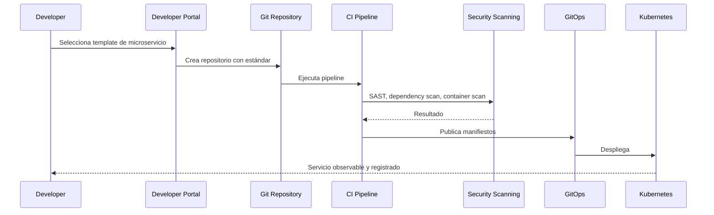

# Platform Architecture

# Plataforma como producto

La plataforma interna debe ofrecer capacidades reutilizables para que los squads entreguen software seguro, observable y gobernado sin reinventar infraestructura.

# Capacidades de plataforma

| Capacidad | Descripción |
|---|---|
| Developer Portal | Catálogo de servicios, APIs, owners, documentación y scorecards |
| Golden Paths | Plantillas listas para microservicios, workers, APIs y jobs |
| CI/CD | Build, test, security scanning, artifact publishing |
| GitOps | Despliegue declarativo y auditable |
| Observability | Métricas, logs, trazas, alertas y SLOs |
| Secrets | Gestión centralizada de secretos y rotación |
| Policy as Code | Validación de estándares antes del despliegue |
| Runtime | Kubernetes, service mesh y autoscaling |
| FinOps | Cost visibility y tagging obligatorio |

# Golden path de microservicio

# Scorecard mínimo

- Owner definido.
- README actualizado.
- API/eventos registrados.
- Pipeline activo.
- Tests mínimos.
- Vulnerabilidades críticas bloqueantes.
- Logs estructurados.
- Métricas técnicas y de negocio.
- Dashboards y alertas.
- Runbook operativo.
