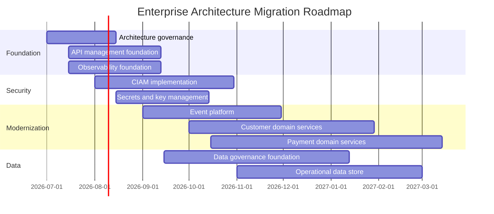

# Migration Planning

# Roadmap por oleadas

# Priorización

| Criterio | Peso |
|---|---:|
| Reducción de riesgo operativo | 25 |
| Impacto en negocio | 25 |
| Habilitación de capacidades futuras | 20 |
| Cumplimiento / seguridad | 15 |
| Complejidad y dependencias | 15 |

# Dependencias críticas

- CIAM debe preceder a rediseño de canales.
- API Management debe preceder a exposición externa masiva.
- Observabilidad debe preceder a migraciones críticas.
- Event Platform debe preceder a desacoplamiento de core.
- Data Governance debe preceder a modelos analíticos críticos.

# Estrategia de migración

- Evitar big bang.
- Usar strangler pattern para dominios críticos.
- Priorizar nuevas capacidades en arquitectura target.
- Mantener coexistencia controlada con legado.
- Medir reducción de deuda técnica por oleada.
