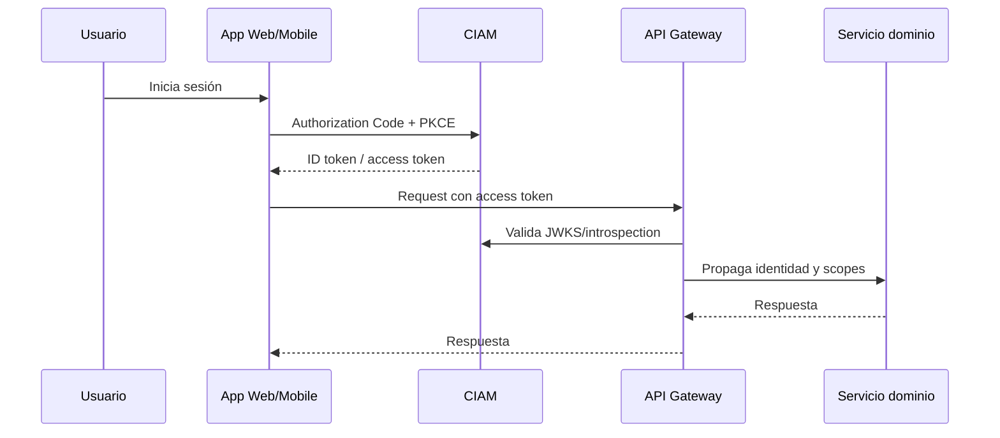

# Security Architecture

# Objetivos

- Proteger clientes, transacciones y datos sensibles.
- Reducir riesgo de fraude, abuso y fuga de información.
- Cumplir requerimientos regulatorios y de auditoría.
- Habilitar seguridad automatizada en el SDLC.

# Modelo Zero Trust práctico

| Dominio | Control |
|---|---|
| Identidad | OIDC, MFA, risk-based authentication |
| Dispositivo | Señales de riesgo y postura cuando aplique |
| Red | Segmentación, WAF, mTLS interno en servicios críticos |
| Aplicación | SAST, DAST, dependency scanning, secrets scanning |
| Datos | Cifrado, tokenización, clasificación, masking |
| Operación | SIEM, alertas, playbooks, auditoría |
| Plataforma | Policy as code, RBAC, least privilege |

# Flujo de autenticación

# Controles mínimos para servicios críticos

- Autenticación fuerte.
- Autorización por scopes/roles/claims.
- Cifrado TLS.
- Validación de entrada.
- Rate limiting.
- Auditoría de operaciones sensibles.
- Gestión segura de secretos.
- Monitoreo de anomalías.
- Pruebas de seguridad automatizadas.
